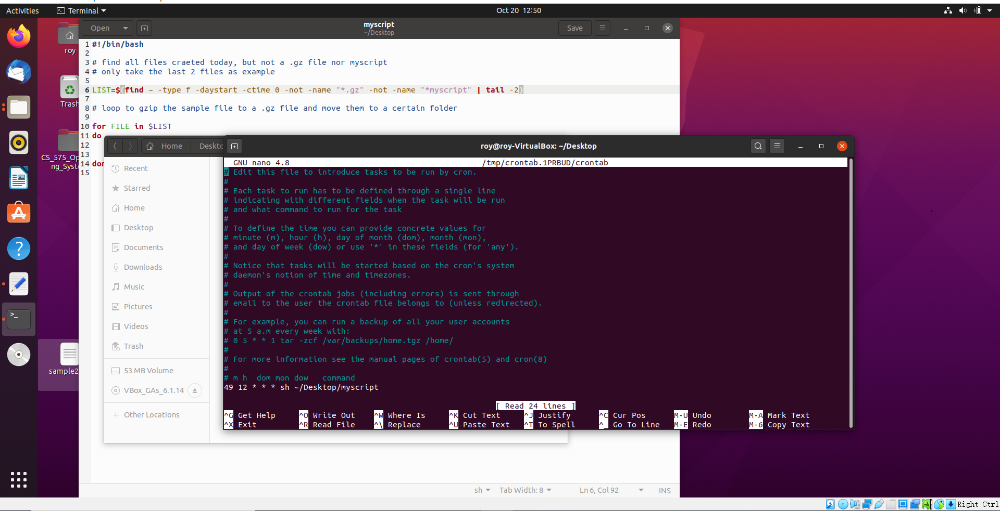
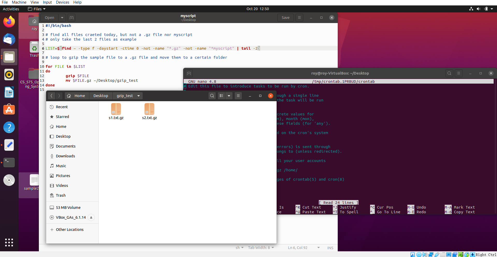

# Linux Cron Job For Compression
 The Cron job will be executed every day and call a script. The script will gzip sample files that are created today.
 
### author: Yi Rong
### date: 07/11/21
---
### 1. create a cron job

### 2. gz files appeared in the certain folder after the cron job got executed
